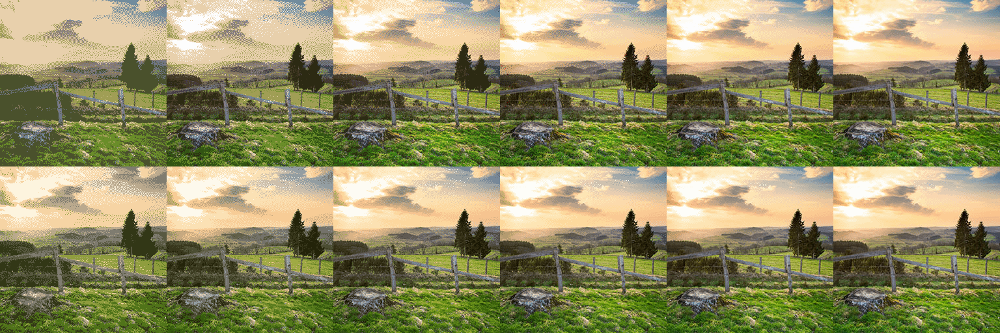

# Color Image Quantization

Usage: 

```
ZIMGQuant < image > -colors < num colors > -dithering < 0 or 1 > -output < output path > -method < octree or kmeans >
```

## Implementation details
This is an implementaton of Color Image Quantization using two methods
- **octrees**: supports any number of colors, not just multiples of 8 by grouping extra colors in one node into a new color
- **kmeans**: using octrees for centroids initialization and kd-trees for nearest neighbour search

**Floyd–Steinberg dithering** has also been implemented to improve the final result

Octrees method is faster but results are much better with kmeans, althought for 32 colors or more the final result is very similar

Original image  


Image converted to 8, 16, 32, 64, 128 and 256 using octrees in the 1st row and kmeans in the 2nd  

